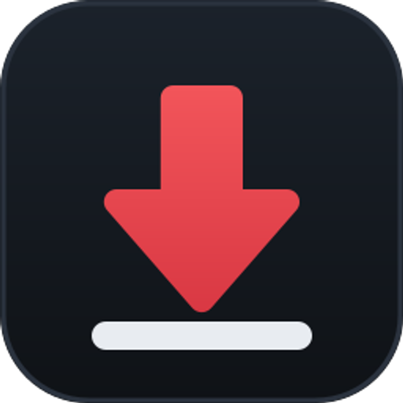

<div align="center">



# YTDM

**A fast, modern download manager for YouTube — built for Windows.**

Queue · Playlists · Subtitles · Pause & resume · Auto-updates

[](https://github.com/Shahzaib-Hasaan/ytdm/releases/latest)
[](https://github.com/Shahzaib-Hasaan/ytdm/releases)
[](LICENSE)
[](#tech-stack)

[**⬇ Download the latest release**](https://github.com/Shahzaib-Hasaan/ytdm/releases/latest)

</div>

---

## Features

- **Download queue** — parallel downloads with pause, resume, retry, and crash recovery; interrupted downloads pick up where they left off
- **Playlists** — paste a playlist link, pick the videos you want, and they download into their own folder
- **Quality presets** — Best MP4 (plays everywhere), best quality, 1080p, 720p, or audio-only M4A/MP3
- **Subtitles** — saved as `.srt` next to the video, fetched rate-limit-safely after the download
- **Clipboard watcher** — copy a YouTube link anywhere and YTDM offers to download it
- **Live stats** — per-download speed graph, ETA, and phase (video / audio / processing)
- **Speed control** — global bandwidth cap shared across downloads
- **System tray** — closing the window keeps downloads running; left-click the tray icon to toggle
- **Auto-update** — the app updates itself, and its download engine updates independently so YouTube changes don't break it
- **Light & dark themes**, thumbnail previews, multi-select bulk actions, safe delete to Recycle Bin

## Install

**[Download the latest `YTDM Setup x.y.z.exe`](https://github.com/Shahzaib-Hasaan/ytdm/releases/latest)** and run it. No other setup: on first launch YTDM fetches its open-source engine (yt-dlp, Deno, FFmpeg) automatically and keeps it current from then on.

> **"Windows protected your PC"?** New open-source apps without a paid certificate trigger
> SmartScreen until they build reputation. Click **More info → Run anyway**. The full source
> is public in this repository — audit it, or build the installer yourself. A signed release
> pipeline via SignPath Foundation is in progress.

Coming soon: `winget install ytdm` ([submission under review](https://github.com/microsoft/winget-pkgs/pull/415531)).

## How it works

YTDM orchestrates battle-tested open-source tools rather than reinventing them:

| Component | Role |
|---|---|
| [yt-dlp](https://github.com/yt-dlp/yt-dlp) | Extraction + transfer engine, auto-updated nightly (YouTube changes constantly) |
| [FFmpeg](https://ffmpeg.org) (LGPL build) | Lossless merge of YouTube's separate video/audio streams, metadata embedding |
| [Deno](https://deno.com) | Sandboxed JS runtime yt-dlp needs for YouTube's player challenges |
| Electron + TypeScript | The app itself: queue engine, UI, tray, updater |

Downloads run as supervised child processes with machine-readable progress. The queue persists in SQLite, so nothing is lost across restarts. Engine binaries live in `%APPDATA%\YTDM\bin` and update on their own schedule — the app stays working even when YouTube changes things weekly.

## Build from source

```bash
git clone https://github.com/Shahzaib-Hasaan/ytdm.git
cd ytdm
npm install
npm run dev        # hot-reload development app
npm run typecheck  # TypeScript checks
npm run dist       # production NSIS installer -> release/
```

Requires Node 22+. Release builds are produced by [GitHub Actions](.github/workflows/release.yml) from tagged commits.

## Browser extension

The [`extension/`](extension) folder contains a WebExtension that puts a **Download**
button on YouTube video, Shorts, and playlist pages — one click sends the link to the
YTDM app (which must be running; it lives in your tray).

**Firefox:** `about:debugging` → *This Firefox* → *Load Temporary Add-on* → pick
`extension/manifest.json`. (Store listing planned.)

**Chrome / Edge:** `chrome://extensions` → enable *Developer mode* → *Load unpacked* →
pick the `extension` folder.

The extension talks only to the app on your own machine (`127.0.0.1`), and the app
accepts requests from browser extensions only.

## Roadmap

- Extension store listings (Firefox AMO, Edge Add-ons)
- Download scheduler and post-queue actions
- Channel subscriptions — auto-download new uploads
- Download history and categories
- Generic HTTP download acceleration for non-YouTube links

Suggestions welcome — [open an issue](https://github.com/Shahzaib-Hasaan/ytdm/issues).

## Code signing policy

Free code signing provided by [SignPath.io](https://signpath.io), certificate by
[SignPath Foundation](https://signpath.org).

Team roles: [Shahzaib Hassan](https://github.com/Shahzaib-Hasaan) — sole maintainer,
acting as Author, Reviewer, and release Approver. Releases are built from tagged commits
by [GitHub Actions](.github/workflows/release.yml) and signed only after manual approval.

## Privacy policy

YTDM does not collect, store, or transmit any personal data or telemetry. The app
communicates only with YouTube (to fetch the videos you request) and GitHub (to download
its open-source engine components and app updates). All settings and download history
stay in a local database on your machine.

## Legal

MIT licensed — see [LICENSE](LICENSE). YTDM invokes yt-dlp, FFmpeg, and Deno as separate
processes; their licenses and sources are available at the links above.

Downloading YouTube content may violate YouTube's Terms of Service. Use YTDM only for
your own content, Creative Commons material, or content you otherwise have the right
to save. You are responsible for how you use this tool.

## Contact

**Shahzaib Hassan** · <shahxeebhassan@gmail.com> · [shahzaibbuilds.me](https://shahzaibbuilds.me) · [LinkedIn](https://www.linkedin.com/in/shahzaib-hassan-ai-developer/)

Bug reports: [open an issue](https://github.com/Shahzaib-Hasaan/ytdm/issues) with the error
text from the download's status chip (hover it).
